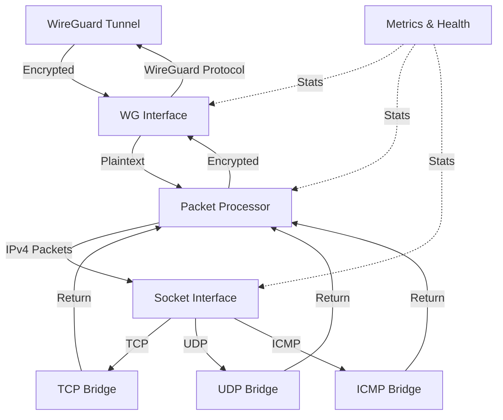

# Userspace WireGuard Router

A high-performance, userspace WireGuard router that forwards decrypted IPv4 traffic via generic TCP/UDP/ICMP socket bridges (slirp-style), requiring no kernel privileges or custom netstacks.

## Table of Contents

- [Overview](#overview)
- [Architecture](#architecture)
- [Installation](#installation)
  - [Using Docker](#using-docker)
  - [Building from Source](#building-from-source)
- [Quick Start](#quick-start)
- [Configuration](#configuration)
  - [WireGuard Configuration](#wireguard-configuration)
  - [System Configuration](#system-configuration)
- [Usage Examples](#usage-examples)
- [Troubleshooting](#troubleshooting)
- [License](#license)
- [Acknowledgments](#acknowledgments)

## Overview

This router combines WireGuard VPN with a userspace networking implementation to provide efficient, secure, container-friendly routing. It uses a slirp-style approach to handle TCP, UDP, and ICMP traffic between WireGuard tunnels and the host network.

### Key Features

- **WireGuard Integration**: Secure, modern VPN tunneling with WireGuard protocol
- **User-space Networking**: TCP/UDP bridges implemented in userspace
- **Protocol Support**: Handles TCP, UDP, and ICMP traffic with NAT capabilities
- **Performance Monitoring**: Built-in metrics collection and reporting
- **Health Checking**: Integrated health checks for monitoring system status
- **Container Ready**: Designed to run in containerized environments
- **Configurable**: Extensive configuration options via environment variables

## Architecture

The router consists of several key components:

1. **WireGuard Interface**: Handles encrypted tunnel traffic using the WireGuard protocol
2. **Socket Interface**: Manages TCP/UDP bridges for network traffic translation
3. **Simple Slirp Bridges**: Direct inline delivery between slirp bridges and the processor. No FlowManager or egress limiter — simpler, predictable pipeline by default.
4. **Metrics Reporter**: Collects and reports performance metrics

The system uses a packet processing pipeline to efficiently route traffic between WireGuard tunnels and the host network.



## Installation

### Using Docker

The easiest way to run the router is using Docker:

```bash
docker run -d \
  --name wgrouter \
  -p 51820:51820/udp \
  -e WG_PRIVATE_KEY=<your-private-key> \
  -e WG_LISTEN_PORT=51820 \
  -e WG_PEERS=<peer-config> \
ghcr.io/irctrakz/wgslirp:latest
```

### Building from Source

To build from source:

```bash
# Clone the repository
git clone https://github.com/irctrakz/wgslirp.git
cd wgslirp

# Build the binary
go build -o wgrouter ./cmd/wgrouter

# Or build the Docker image
docker build -t wgslirp -f Dockerfile .
```

## Quick Start

Get up and running quickly with these steps:

1. **Generate WireGuard Keys**:
   ```bash
   # Generate private key
   wg genkey > private.key
   
   # Generate public key from private key
   cat private.key | wg pubkey > public.key
   
   # View your keys
   echo "Private key: $(cat private.key)"
   echo "Public key: $(cat public.key)"
   ```

2. **Start the Router**:
   ```bash
   docker run -d \
     --name wgrouter \
     -p 51820:51820/udp \
     -e WG_PRIVATE_KEY=$(cat private.key) \
     -e WG_PEERS="public_key=$(cat peer-public.key),allowed_ips=10.0.0.2/32" \
     ghcr.io/irctrakz/wgslirp:latest
   ```

3. **Configure Client**:
   Create a WireGuard client configuration:
   ```ini
   [Interface]
   PrivateKey = <client-private-key>
   Address = 10.0.0.2/32
   
   [Peer]
   PublicKey = <your-public-key>
   Endpoint = <your-server-ip>:51820
   AllowedIPs = 0.0.0.0/0
   PersistentKeepalive = 25
   ```

4. **Verify Connection**:
   ```bash
   # Check router logs
   docker logs wgrouter
   
   # From client, ping through the tunnel
   ping 10.0.0.1
   ```

  Note: If you're not running with CAP_NET_RAW you can't ping, try a tcp connection

## Configuration

The router is configured primarily through environment variables:

### WireGuard Configuration

| Environment Variable | Description | Default |
|----------------------|-------------|---------|
| `WG_PRIVATE_KEY` | Base64-encoded WireGuard private key (required) | - |
| `WG_LISTEN_PORT` | UDP port for WireGuard to listen on | 51820 |
| `WG_PEERS` | Comma-separated list of peer configurations | - |
| `WG_OVERLAY_ROUTING` | Enable overlay routing mode (1/true/yes/on) | - |
| `WG_OVERLAY_EXCLUDE_CIDRS` | Comma-separated CIDRs to exclude from overlay routing | - |

### Peer Configuration Format

Each peer in the `WG_PEERS` variable should follow this format:
```
public_key=<base64-key>,allowed_ips=<cidr1,cidr2,...>,endpoint=<host:port>,persistent_keepalive=<seconds>
```

### System Configuration

| Environment Variable | Description | Default |
|----------------------|-------------|---------|
| `DEBUG` | Enable debug logging (1/true/yes/on) | - |
| `METRICS_LOG` | Enable metrics logging | - |
| `METRICS_INTERVAL` | Interval for metrics reporting | 30s |
| `METRICS_FORMAT` | Format for metrics output (text/json) | text |
| `HEALTHCHECK` | Enable health checking | - |

### Environment Variables (reference)

Core WireGuard (required/primary)

- `WG_PRIVATE_KEY`: Base64 private key for the device (required).
- `WG_LISTEN_PORT`: UDP listen port, default 51820.
- `WG_MTU`: Plaintext MTU for the userspace TUN (default 1380).
- `WG_PEERS`: Comma-separated peer indices (e.g., `0,1`). For each index `i`:
  - `WG_PEER_i_PUBLIC_KEY`: base64 peer public key (required for each peer).
  - `WG_PEER_i_ALLOWED_IPS`: comma-separated CIDRs for overlay routing decisions.
  - `WG_PEER_i_ENDPOINT`: `host:port` (optional if static endpoint is used).
  - `WG_PEER_i_KEEPALIVE`: seconds (optional; typical 25).

Overlay routing (optional)

- `WG_OVERLAY_ROUTING`: enable overlay re-route for packets destined to AllowedIPs.
- `WG_OVERLAY_EXCLUDE_CIDRS`: CIDRs that should always egress via slirp.
- `WG_DISABLE_IPV6`: truthy to attempt disabling IPv6 sysctls (best effort).

Logging and diagnostics

- `DEBUG`: enable verbose logging and disable packet copy-elision in wrappers.
- `WG_DEBUG`: verbose wireguard-go logging (chatty).
- `WG_PCAP`: file path to write plaintext IPv4 frames (DLT_RAW) captured by the userspace TUN.

Metrics and health

- `METRICS_LOG`: any non-empty value enables periodic metrics logging.
- `METRICS_INTERVAL`: duration like `15s` (default `30s`).
- `METRICS_FORMAT`: `text` (default) or `json`.
- `HEALTHCHECK`: any non-empty value enables auxiliary health probes.
- `HEALTH_HTTP_URL`: optional HTTP URL to fetch periodically.
- `HEALTH_DNS_NAME`: optional DNS name to resolve (A-record).
- `HEALTH_DNS_IP`: optional dotted-quad to check reachability.

Packet processing and TUN (userspace)

- `PROCESSOR_WORKERS`: number of workers in the socket processor (default 4).
- `PROCESSOR_QUEUE_CAP`: processor channel capacity (default 1000).
- `WG_TUN_QUEUE_CAP`: capacity of the WGTun outbound queue to wireguard-go (default 1024).
- `POOLING`: enable pooled buffers (1/true/on) for lower GC when throughput is high.

TCP slirp (userspace)

- `TCP_ACK_DELAY_MS`: delayed ACK timer (ms). Lower (e.g., 5) reduces ACK latency.
- `TCP_ENABLE_SACK`: advertise SACK permitted in SYN-ACK (recommended 1 for modern stacks).
- `TCP_MSS_CLAMP`: clamp advertised MSS (bytes). Leave unset unless troubleshooting PMTUD.
- `TCP_PACE_US`: microseconds to sleep between host→guest segments (0 disables). Use only when packet bursts cause loss/ECN on marginal paths.
- `TCP_GATE_LOG`: controls send-gating logs; `off` disables, `debug` logs at debug level, `info` logs at info level (default).
- `TCP_CC`: congestion control algo for host→guest path; `off` to disable, default newreno.
- `TCP_ERROR_SIGNAL`: how to signal outbound connect failure to the guest: `icmp` (default), `rst`, or `none`.
- `TCP_FAST_DIAL_MS`: fast pre-dial timeout (ms) to map immediate refusals to ICMP/RST without sending SYN-ACK first (default ~5ms).
- `TCP_SOCK_RCVBUF`, `TCP_SOCK_SNDBUF`: optional OS socket buffer sizes for host TCP connections.
- `TCP_ACK_IDLE_GATE_MS`, `TCP_ACK_IDLE_MIN_INFLIGHT`, `TCP_ACK_IDLE_FAIL_SEC`: advanced gating of host reads when no guest ACK progress. Defaults: `TCP_ACK_IDLE_GATE_MS=6000`, `TCP_ACK_IDLE_FAIL_SEC=120`; `TCP_ACK_IDLE_MIN_INFLIGHT` defaults to ~1 MSS when unset.

IP header synthesis

- `COPY_TOS`: truthy to copy DSCP/ECN from outbound to synthesized return packets.
- `IP_TTL`: override TTL for synthesized return packets (1–255; default 64).

Notes:
- Simple mode is always on: there is no FlowManager or egress limiter in the pipeline. Any legacy FLOW_* envs are ignored.
- `WG_TUN_ASYNC_WRITE` and related `WG_TUN_IN_*` knobs are ignored in simple mode.

### Performance Tuning (optional)

| Environment Variable | Description | Default |
|----------------------|-------------|---------|
| `POOLING` | Enable pooled buffers to reduce alloc/GC (1/true) | off |
| `PROCESSOR_WORKERS` | Number of packet processor workers | 4 |
| `PROCESSOR_QUEUE_CAP` | Processor channel capacity | 1000 |
| `WG_TUN_QUEUE_CAP` | WGTun out queue capacity toward wireguard-go | 1024 |
| `TCP_ACK_DELAY_MS` | Delayed ACK timer (milliseconds) | 10 |

### Simple Mode

The router now always operates in simple mode: inline delivery, no FlowManager, no egress limiter. `SIMPLE_MODE` is treated as on by default and may be removed in future releases.

<!-- Auto-Fallback removed -->

### Metrics Reporter

Enable periodic metrics logs for visibility. Text or JSON formats are supported. Set either env to any non-empty value to enable.

| Environment Variable | Description | Default |
|----------------------|-------------|---------|
| `METRICS_LOG` | Enable metrics logging | - |
| `METRICS_INTERVAL` | Interval for metrics reporting (e.g., `15s`) | 30s |
| `METRICS_FORMAT` | `text` or `json` | text |

Selected counters (subset):
- Totals per bridge (packets/bytes/errors) and active flows.
- TCP extras: `rto`, `active_rto_flows`, `rto_delta`.
- Async dial/pending (tcp slirp): `dial_start`, `dial_ok`, `dial_fail`, `dial_inflight`, `pend_enq`, `pend_flush`, `pend_drop`.
- WG plaintext: `plaintext_from_wg`, `plaintext_to_wg`, `queue_drops`.


#### Tuning Example (docker-compose)

```yaml
services:
  wg-router:
    image: wgserver:latest
    container_name: wgserver
    ports:
      - "51820:51820/udp"
    environment:
      - "POOLING=1"
      - "PROCESSOR_WORKERS=8"
      - "PROCESSOR_QUEUE_CAP=4096"
      # FlowManager removed; no FLOW_QUEUE_CAP
      - "WG_TUN_QUEUE_CAP=2048"
      - "TCP_ACK_DELAY_MS=5"
      - "METRICS_INTERVAL=15s"
      - "METRICS_FORMAT=json"

      - "DEBUG=0"
      # WireGuard settings (examples — replace with your values)
      - "WG_PRIVATE_KEY=<base64-private-key>"
      - "WG_LISTEN_PORT=51820"
      - "WG_MTU=1380"
      - "WG_PEERS=1"
      - "WG_PEER_0_PUBLIC_KEY=<base64-peer-public>"
      - "WG_PEER_0_ALLOWED_IPS=0.0.0.0/0"
      - "WG_PEER_0_KEEPALIVE=25"
    restart: "no"
```

These values have proven effective for high‑throughput, low‑latency operation on multi‑core hosts. Adjust upward/downward based on observed metrics (processor queue drops, Flow max_depth, WG queue_drops) and available memory/CPU.

### ICMP Privileges

ICMP echo and other raw ICMP operations require raw socket privileges (e.g., `CAP_NET_RAW`). In typical container environments without this capability, the router will silently drop ICMP packets from guests (logged at debug level) to avoid disrupting TCP/UDP traffic. If ICMP is required, grant the container appropriate capabilities or run outside a restricted environment.

**Note**: To disable metrics completely, ensure both `METRICS_LOG` and `METRICS_INTERVAL` are unset or empty. Setting either of these variables to any non-empty value will enable metrics reporting.

## Usage Examples

### Basic WireGuard Router

```bash
docker run -d \
  --name wgrouter \
  -p 51820:51820/udp \
  -e WG_PRIVATE_KEY=<base64-private-key> \
  -e WG_PEERS="public_key=<base64-public-key>,allowed_ips=10.0.0.2/32,endpoint=peer.example.com:51820" \
  ghcr.io/irctrakz/wgslirp:latest
```

### With Metrics and Debug Logging

```bash
docker run -d \
  --name wgrouter \
  -p 51820:51820/udp \
  -e WG_PRIVATE_KEY=<base64-private-key> \
  -e WG_PEERS="public_key=<base64-public-key>,allowed_ips=10.0.0.2/32" \
  -e DEBUG=1 \
  -e METRICS_LOG=1 \
  -e METRICS_INTERVAL=60s \
  -e METRICS_FORMAT=json \
  ghcr.io/irctrakz/wgslirp:latest
```

### With Overlay Routing

```bash
docker run -d \
  --name wgrouter \
  -p 51820:51820/udp \
  -e WG_PRIVATE_KEY=<base64-private-key> \
  -e WG_PEERS="public_key=<base64-public-key>,allowed_ips=10.0.0.0/24,192.168.1.0/24" \
  -e WG_OVERLAY_ROUTING=1 \
  -e WG_OVERLAY_EXCLUDE_CIDRS="172.16.0.0/12,169.254.0.0/16" \
  ghcr.io/irctrakz/wgslirp:latest
```

### Docker Compose full example

```
version: "2.4"

services:
  wg-router:
    image: wgserver:latest
    container_name: wgserver
    ports:
      - "51820:51820/udp"
    environment:
      - "POOLING=0"
      - "PROCESSOR_WORKERS=8"
      - "PROCESSOR_QUEUE_CAP=4096"
      # FlowManager removed; no FLOW_QUEUE_CAP
      - "WG_TUN_QUEUE_CAP=2048"
      - "TCP_ACK_DELAY_MS=5"
      - "TCP_ENABLE_SACK=1"
      - "METRICS_LOG=1"
      - "METRICS_INTERVAL=15s"
      - "DEBUG=0"
      - "TCP_DEBUG_FLOW=0"
      - "WG_PRIVATE_KEY=<private_key>"
      - "WG_LISTEN_PORT=51820"
      - "WG_MTU=1380"
      - "WG_PEERS=0"
      - "WG_PEER_0_PUBLIC_KEY=<public_key>"
      - "WG_PEER_0_ALLOWED_IPS=10.77.0.2/32"
    restart: "no"
```

## Troubleshooting

### Common Issues

1. **Connection Failures**
   - Verify WireGuard keys are correctly formatted (base64-encoded)
   - Check that UDP port 51820 (or your configured port) is open in firewalls
   - Ensure peer endpoints are reachable

2. **Performance Issues**
   - Enable metrics logging to identify bottlenecks
   - Check for excessive connection counts or packet drops
   - Consider adjusting MTU settings if needed

3. **High CPU Usage**
   - This can be normal for high-throughput scenarios
   - Consider disabling debug mode in production

### Debugging

Enable debug mode to get verbose logging:

```bash
docker run -d \
  --name wgrouter \
  -p 51820:51820/udp \
  -e WG_PRIVATE_KEY=<base64-private-key> \
  -e WG_PEERS="public_key=<base64-public-key>,allowed_ips=10.0.0.2/32" \
  -e DEBUG=1 \
  ghcr.io/irctrakz/wgslirp:latest
```

View logs with:

```bash
docker logs wgrouter
```

## License

This project is licensed under the MIT License - see the LICENSE file for details.

## Acknowledgments

- [WireGuard](https://www.wireguard.com/) for the secure VPN protocol
- All contributors to this project
